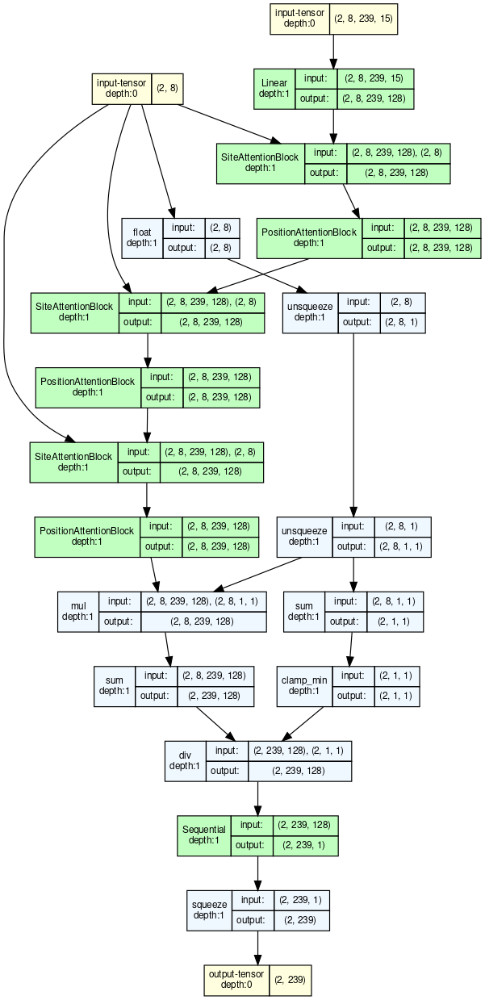

# 03 — Preprocess module + model architecture (v7-real Channel B)

**Date:** 2026-09-20
**Grounded in:** `model/channel_b/constants.py`, `model/channel_b/data.py`,
`model/channel_b/model.py`, `scripts/build_v7_shard.py`,
`preprocess/features_structure_v2.py`. Line references match repo state
at commit `cc5aaa4` (tag `v7-real-frozen`).

Two independent stages sit between a JSONL record and a scalar bag
score: **preprocess** (offline shard build + on-the-fly per-bag tensor
construction) and **model** (cross-site + position attention over that
tensor). This note documents both.

---

## Input record schema (v7 JSONL, per site)

```json
{
  "site_id":        "...",
  "transposase_id": "<bag_id>",         // groups sites into bags
  "ncrna_id":       "...",
  "inputs": {
    "flank": "<120 bp ACGT>",           // 60 left + 60 right of junction
    "noncoding_regions": ["<nc str>", ...]
  },
  "labels": {
    "is_positive":                 bool, // bag-level supervised target
    "guide_span_in_active_noncoding": [start, end] | None,
    "guide_length":                int,  // model reads via whitelist
    "arch": {
      "n_sites":                   int,           // 3..8
      "nc_multi_region_scoring":   "concat_with_N_spacer" | absent,
      "nc_homology_rate":          float,         // stratification only
      "flank_offset_mode":         str            // stratification only
    }
    // + TRAIN_ONLY fields consumed by target builder, blocked from input
  }
}
```

Field discipline: three keys — `INPUT_TENSOR_LABEL_WHITELIST`,
`TARGET_ONLY_LABEL_KEYS`, `TRAIN_ONLY_LABEL_KEYS` — are set in
`constants.py`. `data.py::_read_input_label` asserts every labels-side
read for input construction is in the whitelist; a train-only key
raises immediately, closing the class of train/deploy gap that
`finding-train-deploy-gap-fields` names.

---

## Preprocess stage 1 — offline shard build

Script: `scripts/build_v7_shard.py` → `shard_dir/{tnp_id}.npz`
+ `_index.json` + `_seqs.json`.

Per bag, for **each site × orient ∈ {fwd, rc} × L ∈ {9, 10, 11, 12}**,
computes and stores:

- `m_max_by_excl[0]`: per-position max match count of the L-window
  against the nc (int8 array of length `nc_len - L + 1`)
- `flank_argmax_by_excl[0]`: per-position argmax offset into the flank
  where that max match sits

Compute path is `scripts.v5a_framework.match_table._compute_site_arrays`,
which is the canonical proposer statistic across the project. Both
orientations are stored — the loader will combine them at load time
(orient is a gold label at training; storing both preserves the
option to be deploy-legal at inference).

Shard build is idempotent and cache-content-keyed
(`feedback_cache_content_key`); a source-hash change invalidates it.

---

## Preprocess stage 2 — on-the-fly per-bag tensor

Class: `model/channel_b/data.py::ChannelBDataset._build_bag_inputs`.

### Step 1 — resolve `canonical_nc`

`nc` comes from `inputs.noncoding_regions`, **not** from a
labels-side canonical (that reintroduced a train/deploy gap in the
2026-09-10 revision).

- 1 region → use as-is.
- >1 regions → `concat_with_N_spacer` with a spacer of
  `MAX_L - 1 = 11` Ns. The declaration `arch.nc_multi_region_scoring`
  is **mandatory**; any other value raises, and the missing case
  raises too (no default policies). Rationale: with spacer length
  `MAX_L - 1`, no L-window with L ∈ Ls can span both real regions,
  so cross-boundary false matches are impossible.

`nc_len_eff = nc_len - MAX_L + 1` — the position axis is trimmed so
every L-window aligns end-to-end within the nc.

### Step 2 — structure channels (bag-level, broadcast across sites)

`preprocess/features_structure_v2.py::compute_features_v2(canonical_nc, guide_length=MAX_L=12)`
returns per-position arrays computed once from ViennaRNA (BPP-based,
replaces the RNAplfold windowing that was falsified on real bridge
RNAs 2026-08-31):

| channel | what |
|---|---|
| `dG_open_uL_pn` | per-nt normalized ΔG to open the L-length window at i |
| `H_pair_win` | entropy of the pairing distribution over the window |
| `cooperativity_win_pn` | per-nt cooperativity term |
| `E_span_win` | expected span of paired bases within the window (weakest channel per spec) |
| `structure_valid` | 1 where above are valid, 0 where NaN → replaced by 0 |

NaN → 0 with an explicit validity mask channel; no silent fill.

### Step 3 — per-site per-L m_max and flank_argmax

Deploy-legal combination of the two shard orientations:

```
m_max[s, p, L]        = max(m_fwd[s, p, L], m_rc[s, p, L])
flank_argmax[s, p, L] = argmax_fwd  if m_fwd wins at (s, p, L)
                        else argmax_rc
```

Orient is a gold label at training. Reading it to pick which orient's
array to use was the 2026-09-10 orient-leak bug; the fix reads BOTH
orients and combines per-position, so no orient label enters the
input tensor.

If a shard cell is missing `flank_argmax`, the loader **raises by
default** (see `_allow_missing_flank_argmax=False`) — this is the
fail-fast rail added after the 2026-09-08 Durrant zero-fill incident
(`feedback_channel_stats_preflight`).

### Step 4 — flank deviation encoding (the cross-site coherence signal)

For each (position, L):

```
bag_median[p, L]   = median_s flank_argmax[s, p, L]
flank_dev[s, p, L] = (flank_argmax[s, p, L] - bag_median[p, L])
                     / FLANK_DEV_SCALE=10.0
```

This is the encoding v7-real is built around: sites of the same
element hitting the flank at consistent argmax offsets → `flank_dev`
near zero at the true guide position. Divergent sites → large
`flank_dev` at that position. Cross-site coherence becomes a
per-position statistic the model can attend to.

### Step 5 — assemble the 15-channel tensor

Shape `(MAX_N_SITES=8, nc_len_eff, N_CHANNELS=15)`:

| ch | name | source |
|---|---|---|
| 0-3 | `m_max_L{9,10,11,12}` | per-site per-L m_max |
| 4-7 | `dG_open_uL_pn`, `H_pair_win`, `cooperativity_win_pn`, `E_span_win` | structure (broadcast) |
| 8 | `structure_valid` | structure NaN mask (broadcast) |
| 9-12 | `flank_dev_L{9,10,11,12}` | per-site per-L bag-median-relative argmax |
| 13-14 | `orient_fwd`, `orient_rc` | **intentionally zero** (was gold-leak; orient info is already implicit in ch 0-3 and 9-12) |

Then `x /= CHANNEL_SCALES[c]` (fixed per-channel divisor).

**No BatchNorm, no LayerNorm on inputs.** Fixed divisors are chosen
so BatchNorm's three failure modes are avoided: (a) batch-statistic
coupling breaks bit-exact site-permutation equivariance, (b) running-
stats create train/deploy divergence, (c) padded zeros cannot be
distinguished from real zeros. Divisors are documented in
`CHANNEL_SCALES` and are checked at load — a channel that shifts
range materially in a corpus refresh should prompt a revisit, but
divisors are NEVER a per-dataset stat file (that would recreate
the gap they were designed to prevent).

### Step 6 — mask + meta

- `site_mask ∈ {True, False}^8` — True for real sites, False for padding.
- `meta` dict — stratification only (`bag_id`, `n_sites`, `hom`,
  `gc_target`, `epsilon_align_{mean,max}`, `flank_offset_mode`,
  `negative_mode`, `region_boundaries`). Never touched by the model.

Per-bag output: `BagInputs(x, site_mask, y, label, meta)`.

### Step 7 — target `y` (training only)

`_build_target(sites, nc_len_eff) → (nc_len_eff,) float32`:
one-hot-ish count vector — `y[p]` = number of planted sites whose
`guide_span_in_active_noncoding[0] == p`. Ordinal regression target
per spec §3. Reads `is_planted` and `guide_span_in_active_noncoding`
via the SEPARATE `_build_target` path (both in `TARGET_ONLY_LABEL_KEYS`),
so nothing from target construction can leak into the model input.

### Step 8 — cache

Per-bag `.pt` cache keyed by a **content hash** (not by name) — this
closed the v7-real cache-collision bug where `v6r2` tensors were being
served under `v7` labels for 160k bags (`feedback_cache_content_key`).
Any cache with a shape/key mismatch is silently rebuilt.

### Collate

`bucket_collate_fn` (data.py) stacks items whose `nc_len_eff` may
differ, pads to per-batch max on the position axis, and builds a
`pos_mask` per item that marks the real positions. Site padding is
already handled at the item level by `site_mask`. Output:

```
{
  "x":         (B, S=8, max_pos, 15)  float32,
  "site_mask": (B, S=8)               bool,
  "pos_mask":  (B, max_pos)           bool,
  "y":         (B, max_pos)           float32,
  "labels":    (B,)                    float32,
  "meta":      list of dicts
}
```

`pos_mask` is used at scoring time to bound the max over positions
(the bag-level operating score).

---

## Model architecture

`model/channel_b/model.py::ChannelBModel`.

### Rendered figure

Traced from the actual `ChannelBModel` via `torchview` with input
`(B=2, S=8, P=239, C=15)` and `site_mask=(2, 8)` (site 0 masked to
n_sites=6 so the pool math shows).



Files under `result_note/figures/`:

| file | depth | what |
|---|---|---|
| `channel_b_model_compact.png` | 1 | top-level blocks; the readable one |
| `channel_b_model_mid.png` | 2 | expands attention blocks (LN, MHA, FF); ~6000 px tall |
| `channel_b_model_full.png` | 4 | expands everything (Q/K/V, softmax, dropout); ~9000 px tall |
| `channel_b_model.svg` | 3 | zoomable vector for detailed reading |

Regenerate with `scripts/torchview_channel_b.py` (not yet committed;
one-off command in the note's provenance).

### Visual

```
                     Channel B model (v7-real)

INPUT
  x         : (B, S=8, P, C=15)   preprocessed 15-channel tensor
  site_mask : (B, S=8)            True where site is real
  pos_mask  : (B, P)              True where position is real
                │
                ▼
        ┌──────────────────────────────┐
        │  Linear(15 → H=128)          │   per (site, position) cell
        └──────────────────────────────┘
                │  h : (B, S, P, H)
                ▼
   ╔══════════════════════════════════════════════════════════╗
   ║                    ×  N_blocks = 3                       ║
   ║                                                          ║
   ║   ┌────────────────────────────────────────────────┐     ║
   ║   │  SiteAttentionBlock (attend ACROSS SITES)      │     ║
   ║   │                                                │     ║
   ║   │    reshape  (B, S, P, H) → (B·P, S, H)         │     ║
   ║   │                                                │     ║
   ║   │        site 1  ─┐                              │     ║
   ║   │        site 2  ─┼──►  MHA (4 heads) over S     │     ║
   ║   │        site 3  ─┤     mask = ~site_mask        │     ║
   ║   │        site 4  ─┘                              │     ║
   ║   │           ⋮                                    │     ║
   ║   │                                                │     ║
   ║   │    +residual → LN → FF(H → 4H → H) → +res → LN │     ║
   ║   │    reshape back → (B, S, P, H)                 │     ║
   ║   └────────────────────────────────────────────────┘     ║
   ║                       │                                  ║
   ║                       ▼                                  ║
   ║   ┌────────────────────────────────────────────────┐     ║
   ║   │  PositionAttentionBlock (attend ALONG NC)      │     ║
   ║   │                                                │     ║
   ║   │    reshape  (B, S, P, H) → (B·S, P, H)         │     ║
   ║   │                                                │     ║
   ║   │        pos 0 ─┐                                │     ║
   ║   │        pos 1 ─┼──►  MHA (4 heads) over P       │     ║
   ║   │        pos 2 ─┤     no padding on P axis       │     ║
   ║   │           ⋮   ─┘                               │     ║
   ║   │                                                │     ║
   ║   │    +residual → LN → FF(H → 4H → H) → +res → LN │     ║
   ║   │    reshape back → (B, S, P, H)                 │     ║
   ║   └────────────────────────────────────────────────┘     ║
   ╚══════════════════════════════════════════════════════════╝
                │  h : (B, S, P, H)
                ▼
        ┌──────────────────────────────┐
        │  Masked mean pool over S     │   (site pool, per position)
        │    Σ (h * site_mask) / Σ mask│
        └──────────────────────────────┘
                │  h : (B, P, H)
                ▼
        ┌──────────────────────────────┐
        │  Per-position head           │
        │    LN → Linear(H→H) → GELU   │
        │       → Linear(H→1)          │
        └──────────────────────────────┘
                │  pred : (B, P)
                ▼
  ┌──────────────────────────┬──────────────────────────────┐
  │   TRAINING               │   DEPLOY                     │
  │                          │                              │
  │   y  : (B, P) count      │   bag_max_score =            │
  │   loss = MSE(pred, y)    │     max_{p ∈ pos_mask} pred  │
  │                          │                              │
  │   per-position ordinal   │   threshold on the vector,   │
  │   target — count of      │   NOT baked into training    │
  │   sites planted at p     │                              │
  └──────────────────────────┴──────────────────────────────┘
```

Two attention axes, one shape kept end-to-end: `(B, S, P, H)` goes in
and comes out of every block. Site attention encodes cross-site
coherence at each position; position attention lets each site
integrate context along the nc. Pooling comes only after all three
alternations — masked mean over sites — and never over positions
during training.

### Text form

```
input   : (B, S=8, P, C=15)  x, (B, S) site_mask
   │
   ▼
Linear(15 → hidden=128)  applied per (site, position) cell
   │
   ▼
N_blocks=3 alternating:
   ┌─ SiteAttentionBlock(hidden, n_heads=4)      MHA over S axis at each p
   │       key_padding_mask = ~site_mask
   │       pre+post LayerNorm; FF(4×hidden) with residual
   │
   └─ PositionAttentionBlock(hidden, n_heads=4)  MHA over P axis at each s
           no mask (bucket collate keeps P dense within a batch)
           pre+post LayerNorm; FF(4×hidden) with residual
   │
   ▼
Masked mean pool over S:  h * site_mask.float() → sum / count
   │ → (B, P, H)
   ▼
Per-position head:
  LayerNorm(H) → Linear(H → H) → GELU → Linear(H → 1) → (B, P)
```

Default hparams: `hidden=128`, `n_heads=4`, `n_blocks=3`,
`dropout=0.0`. The v7-real frozen checkpoint uses these defaults.

Trained forward returns per-position `pred: (B, P)`. Bag-level score
at deploy is:

```
bag_max_score = max_{p : pos_mask[p]} pred[p]
```

No pool is baked into training — the max is a deployment threshold.

### Design principles the architecture enforces

1. **Site-permutation equivariance (bit-exact).** Multi-head attention
   is uniform on its sequence axis; both softmax and value aggregation
   act permutation-equivariantly. Given any permutation π on sites,
   the output at row π(s) equals what the un-permuted output was at
   row s. This is what makes bag identity permutation-invariant after
   the site pool.

2. **Alternating cross-site / cross-position attention.** Site
   attention lets the model reason about coherence across independent
   insertion events at each position (the RNA-guided signature).
   Position attention lets each site's picture integrate context along
   the nc. Alternating both is Channel B's inductive bar for "read the
   coherence signal, not just per-site max."

3. **Per-position output, no training-time pool.** Bag-level score is
   a deployment threshold on the (B, P) output, not an aggregated
   scalar the loss sees. The training target is the per-position
   ordinal count `n_planted_at_position`, so evidence at each
   position is supervised independently — the model has to be right
   about WHERE, not just that a guide exists.

4. **Deploy-legal input contract.** The 15-channel tensor is the only
   thing the model ever sees, and every one of those channels is
   built from `inputs.*` + shard arrays + ViennaRNA fold at load time.
   No gold label reaches the input tensor at any point in the code
   path — the runtime assert in `_read_input_label` will raise before
   it happens.

---

## Where each piece lives

| stage | file | key entry point |
|---|---|---|
| record schema | (spec) `docs/V7_SPEC.md` § 1.1 | — |
| shard build | `scripts/build_v7_shard.py` | `build_v7_shard()` |
| shard array compute | `scripts/v5a_framework/match_table.py` | `_compute_site_arrays()` |
| structure features | `preprocess/features_structure_v2.py` | `compute_features_v2()` |
| dataset + tensor build | `model/channel_b/data.py` | `ChannelBDataset._build_bag_inputs()` |
| target | `model/channel_b/data.py` | `_build_target()` |
| whitelist enforce | `model/channel_b/data.py` | `_read_input_label()` |
| multi-region policy | `model/channel_b/data.py` | inline in `_build_bag_inputs`, spacer = `MAX_L-1` |
| collate | `model/channel_b/data.py` | `bucket_collate_fn()` |
| model | `model/channel_b/model.py` | `ChannelBModel` |
| constants | `model/channel_b/constants.py` | `CHANNELS`, `MAX_N_SITES`, `Ls`, `MAX_L`, `CHANNEL_SCALES` |

---

## Consumers so far

- **Training runs** — everything in `checkpoints/channel_b/` uses this
  preprocess + model pair. Current freeze: `v7real_main/best.pt`.
- **Inference on strong negatives** — `channel_b_negtop10_control.py`,
  `channel_b_negtop10_realpos.py`. See `02_v7_strong_negative_data.md`.
- **Inference on real bridge RNA (Durrant IS621)** — see
  `finding-durrant-v7real-transfer` in MEMORY.
- **Inference on mgefinder MGE discovery corpus** — the
  `channel_b_fna_ins_discovery.py` scorer from today's first run.
  See `01_v7_data_generation_pipeline.md` and `v7real_scored_v1/`.
